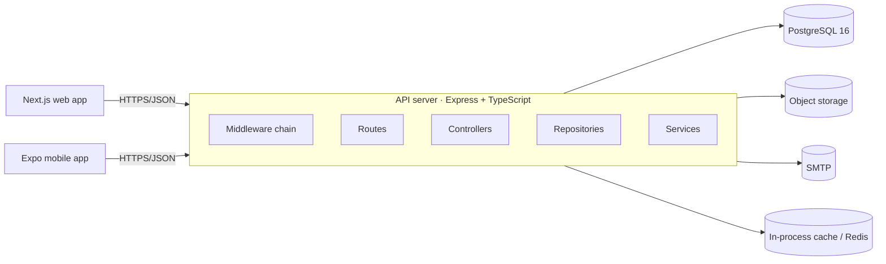
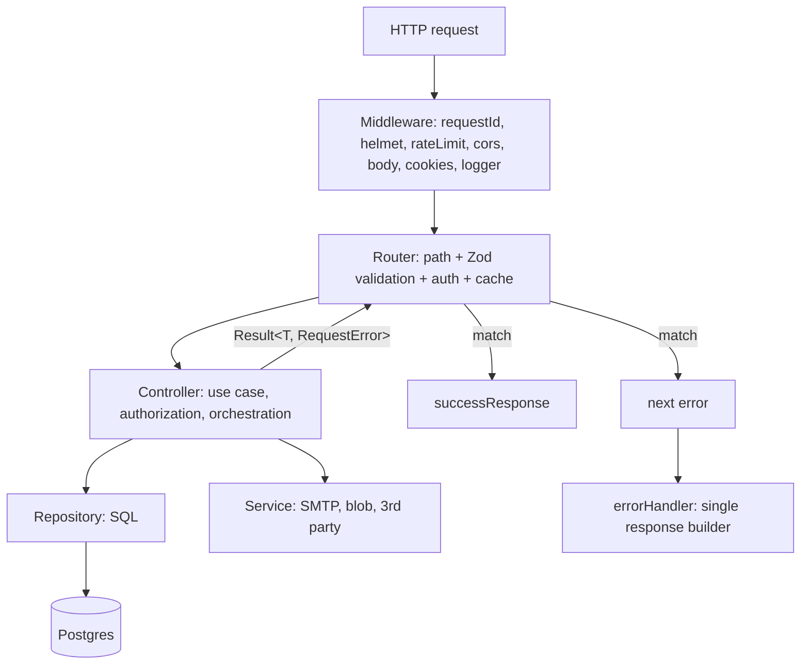
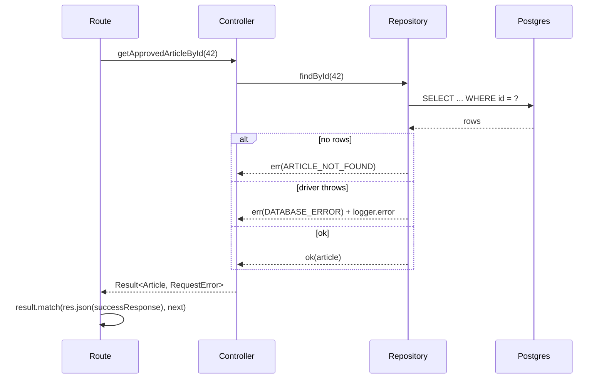

# Backend — 02 High-Level Design

The architecture every BasicTech API server follows, and the reasoning behind it. Read this
before designing a new module or endpoint.

---

## 1. System context



The API server is a **stateless monolith**. Any instance can serve any request. That is a
deliberate choice: it scales horizontally, is trivial to reason about, and defers the
distributed-systems tax until a project actually needs it.

Splitting into services is a company-level decision, not a project one.

---

## 2. Layered architecture



### Why layered and not feature-sliced?

The backend's variance is **technical** (HTTP vs SQL vs external I/O), not **domain**. Every
endpoint does the same four things in the same order. A layered tree makes "where does SQL
live" answerable without opening a file. The frontend's variance *is* domain-shaped, which is
why it is feature-sliced instead. Different problems, different structures — deliberately.

### Layer responsibilities

| Layer | Answers the question | Knows about HTTP? | Knows about SQL? | Can fail? |
|---|---|---|---|---|
| Middleware | "Is this request allowed and well-formed?" | yes | no | yes → `next(err)` |
| Route | "Which use case is this, and what shape is the input?" | yes | no | no (delegates) |
| Controller | "What are the business rules for this use case?" | **no** | no | yes → `err(...)` |
| Repository | "How is this data stored and retrieved?" | no | yes | yes → `err(...)` |
| Service | "How do we talk to that external system?" | no | no | yes → `err(...)` |
| Model | "What shape is a row?" | no | declares tables | no |

**The controller not knowing about HTTP is the load-bearing rule.** It means a controller is a
plain async function that can be unit-tested with no Express, reused by a CLI script or a
queue worker, and read without framework noise.

---

## 3. Request lifecycle

```
1.  requestId          → attach/propagate x-request-id
2.  helmet             → security headers
3.  rateLimit          → 429 if over budget
4.  cors               → origin allowlist
5.  express.json       → parse body (1mb)
6.  cookieParser       → parse cookies
7.  httpLogger         → start timer
8.  router match       → /api/articles/:id
9.  cacheMiddleware    → public GETs only; serve hit and stop
10. authenticate       → verify JWT, set req.user
11. requireRole        → 403 if role insufficient
12. validateRequest    → Zod params/query/body → req.validated
13. handler            → await controller(...)
14. controller         → authorization (ownership), orchestration
15. repository         → parameterised SQL
16. result.match       → successResponse | next(error)
17. errorHandler       → the ONLY place an error becomes a response
18. httpLogger (end)   → one info line with status + durationMs
```

Ordering rules that matter:

- `requestId` is **first** so every subsequent log line correlates.
- `rateLimit` before auth so a token-guessing flood is cheap to reject.
- `cache` before `authenticate`, and therefore **only on public routes** — otherwise you can
  serve one user's data to another.
- `validateRequest` after auth so unauthenticated callers can't probe your schema.
- `errorHandler` is **last**, always registered.

---

## 4. Data flow: `Result` all the way up



No exception crosses a layer boundary. `try/catch` exists only where a third-party library
throws — i.e. inside a repository or service method.

---

## 5. Cross-cutting concerns and where they live

| Concern | Home |
|---|---|
| AuthN | `middleware/auth.middleware.ts` (`authenticate`) |
| AuthZ — role | `middleware/auth.middleware.ts` (`requireRole`) |
| AuthZ — ownership | the **controller** (needs DB state, so it can't be middleware) |
| Validation | `middleware/validate-request.middleware.ts` + per-route `SCHEMA` |
| Caching | `middleware/cache.middleware.ts`, public GETs only |
| Rate limiting | `middleware/ratelimit.middleware.ts` |
| Error → HTTP | `middleware/error.middleware.ts` |
| Correlation & access logs | `middleware/request-id`, `middleware/http-logger` |
| Transactions | repository, via `db.getConnection()` |

---

## 6. Persistence design

- **PostgreSQL 16**, accessed with `pg/promise`, raw parameterised SQL. No ORM.
- One connection **pool**, created once in `database/db.ts`, closed on shutdown.
- Row types are `interface X extends RowDataPacket` in `models/`.
- Reads use cursor pagination (`WHERE id < ? ORDER BY id DESC LIMIT ?`) — see
  [12-pagination.md](12-pagination.md). Offset pagination is banned.
- Writes that touch more than one table run in a transaction.
- Schema evolves through **numbered, forward-only migrations**. No hand-edited DDL on a live DB.

Why no ORM: our queries are read-heavy, index-sensitive, and often involve `FULLTEXT` and
composite joins. An ORM hides the plan, and the abstraction leaks exactly where performance
matters. The cost is discipline about parameterisation — which the guideline enforces.

---

## 7. Caching strategy

Three tiers, applied in this order of preference:

1. **HTTP caching** — `Cache-Control` + `ETag` on public GETs. Costs nothing, scales infinitely.
2. **In-process cache** (`node-cache`) — for hot, small, public, slow-changing responses
   (trending tags, top articles). Only valid while the service is a single instance or the
   staleness is acceptable per-instance.
3. **Shared cache** (Redis) — when there is more than one instance and consistency matters.
   Requires a logged decision.

Rules:

- Cache **public GET responses only**. Never cache a response produced with an
  `Authorization` header.
- Cache only 2xx responses.
- TTLs are named constants in `config/constants.ts`, never inline numbers.
- Every cached route documents its TTL and its invalidation trigger in the API contract.
- Explicit invalidation on write: publishing an article busts the feed keys.

---

## 8. Scalability & failure posture

| Property | Design |
|---|---|
| Statelessness | No session in memory. JWT + DB. Any instance serves any request. |
| Horizontal scale | N replicas behind a load balancer; `trust proxy` set. |
| DB connections | `connectionLimit` sized as `(pool per instance) × replicas < max_connections`. Default 20, not 50. |
| Graceful shutdown | SIGTERM → stop accepting, drain in-flight, `db.end()`, exit. 10s hard cap. |
| Readiness | `/ready` pings the pool; the orchestrator won't route traffic until it passes. |
| Timeouts | Every external call has an explicit timeout. A hung SMTP call must not hold a request open. |
| Retries | Only for idempotent external reads, with jittered backoff and a cap. Never retry a write without an idempotency key. |
| Backpressure | Rate limiter + body size limits + pool queue limit. |

---

## 9. When to add a new component

| Need | Add | Log a decision |
|---|---|---|
| Slow work that shouldn't block a response (image processing, bulk email) | Job queue (BullMQ + Redis) | yes |
| Scheduled work (publish scheduled articles) | Cron container running a `scripts/` entry point | no |
| Multi-instance cache/session | Redis | yes |
| Full-text at scale beyond Postgres `FULLTEXT` | Search service | yes |
| Real-time updates | SSE first; WebSockets only if bidirectional | yes |

Default answer is "not yet". Add infrastructure when a real requirement demands it, not
in anticipation.

---

## 10. Design checklist for a new module or endpoint

- [ ] Which layers change, and does anything cross a boundary?
- [ ] Endpoint list with methods, auth, and cache policy.
- [ ] Data model changes + migration + index plan.
- [ ] New error codes and their range.
- [ ] External systems touched, with timeout and failure behaviour.
- [ ] Caching/invalidation impact.
- [ ] Backwards compatibility for existing mobile clients.
- [ ] Rollout: migration order, feature flag, rollback.
