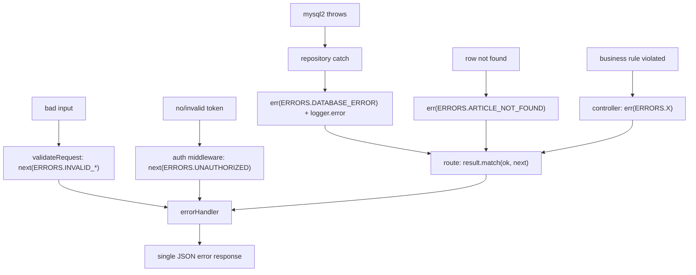

# Backend — 06 Error Handling & Logging

Backend-specific application of [common/04-error-model.md](../common/04-error-model.md) and
[common/05-logging-and-observability.md](../common/05-logging-and-observability.md).

---

## 1. Where each error is produced



| Layer | Produces | How |
|---|---|---|
| Repository | `DATABASE_ERROR`, `<DOMAIN>_NOT_FOUND`, `DUPLICATE_RESOURCE` | `err(...)` from a `try/catch` or an empty-row check |
| Controller | domain rule violations, permission denials | `err(...)`, no `try/catch` |
| Service | integration failures (`OTP_SEND_FAILED`, `FILE_UPLOAD_FAILED`) | `err(...)` from a `try/catch` |
| Middleware | validation, auth, rate limit | `return next(ERRORS.X)` |
| errorHandler | the HTTP response | the only writer of an error body |

---

## 2. The `try/catch` rule

There are **exactly three** legitimate `try/catch` sites in a backend:

1. A repository method wrapping a `db.query`/transaction.
2. A service method wrapping a third-party SDK call.
3. `server.ts` bootstrap.

Anywhere else, a `try/catch` is a smell — it means someone is throwing who shouldn't be.

```ts
// ✅ repository
try { ... } catch (error) { logger.error('op failed', { id, error }); return err(ERRORS.DATABASE_ERROR); }

// ❌ controller
try { const a = await repo.findById(id); } catch { ... }   // repo never throws
```

Never `catch` without either handling or converting. Never `catch (e) { throw e }`.
Never `catch` and log without returning an error — that silently swallows the failure.

---

## 3. Mapping thrown library errors

The error middleware maps known throwables into registry errors in one pure function, which is
unit-testable in isolation.

```ts
// middleware/error.middleware.ts
function mapKnownThrowable(error: unknown): RequestError | null {
  if (!(error instanceof Error)) return null;

  switch (error.name) {
    case 'JsonWebTokenError':  return ERRORS.INVALID_AUTH_TOKEN;
    case 'TokenExpiredError':  return ERRORS.TOKEN_EXPIRED;
    case 'NotBeforeError':     return ERRORS.INVALID_AUTH_TOKEN;
    default: break;
  }

  if (error instanceof SyntaxError && 'body' in error) return ERRORS.INVALID_REQUEST_BODY;
  if (error instanceof ZodError) return ERRORS.VALIDATION_ERROR;

  const code = (error as { code?: string }).code;
  switch (code) {
    case 'ER_DUP_ENTRY':          return ERRORS.DUPLICATE_RESOURCE;
    case 'ER_NO_REFERENCED_ROW':
    case 'ER_NO_REFERENCED_ROW_2':return ERRORS.INVALID_PARAMS;
    case 'ER_ROW_IS_REFERENCED':
    case 'ER_ROW_IS_REFERENCED_2':return ERRORS.RESOURCE_IN_USE;
    case 'LIMIT_FILE_SIZE':       return ERRORS.FILE_TOO_LARGE;
    case 'LIMIT_UNEXPECTED_FILE': return ERRORS.INVALID_FILE_TYPE;
    default: return null;
  }
}
```

Match on `error.code`, not `error.message.includes(...)` — messages change between driver
versions. (The reference matches on `message.includes('ER_DUP_ENTRY')`.)

---

## 4. The error handler

```ts
const logger = createLogger('@error.middleware');

export const errorHandler: ErrorRequestHandler = (error, req, res, _next) => {
  const requestId = req.id;
  const context = {
    requestId,
    method: req.method,
    path: req.route?.path ?? req.path,
    actorId: req.actor?.id,
    bodyKeys: Object.keys((req.body ?? {}) as object),   // keys only — never values
  };

  const known = isRequestError(error) ? error : mapKnownThrowable(error);

  if (known !== null) {
    if (known.statusCode >= 500) logger.error('request failed', { ...context, code: known.code, error });
    else logger.warn('request rejected', { ...context, code: known.code });
    res.status(known.statusCode).json(errorResponse(known.message, known.code, requestId));
    return;
  }

  logger.error('unhandled error', { ...context, error });
  res
    .status(ERRORS.UNHANDLED_ERROR.statusCode)
    .json(errorResponse(ERRORS.UNHANDLED_ERROR.message, ERRORS.UNHANDLED_ERROR.code, requestId));
};

export const notFoundHandler: RequestHandler = (req, res) => {
  res
    .status(404)
    .json(errorResponse(`Route ${req.method} ${req.path} not found`, ERRORS.ROUTE_NOT_FOUND.code, req.id));
};
```

**Rules:**

- Registered **last** in `createApp()`. Register it — this is the single most common omission.
- `4xx` logs at `warn`, `5xx` logs at `error`. Never log a 404 as an error.
- Never send `error.message` of an unknown throwable, in any environment.
- Never send a stack trace.
- Never log `req.body` — only its keys.
- Always echo `requestId` so a user's screenshot maps to a log line.

---

## 5. Process-level safety nets

```ts
// server.ts
process.on('unhandledRejection', (reason) => {
  logger.error('unhandled rejection', { reason });
  process.exit(1);
});

process.on('uncaughtException', (error) => {
  logger.error('uncaught exception', { error });
  process.exit(1);
});
```

Exit, don't continue. A process in an unknown state serving traffic is worse than a restart.
The orchestrator will bring it back; `/ready` keeps traffic away until it's healthy.

---

## 6. Logging placement

| Event | Level | Where |
|---|---|---|
| server started / shutting down | `info` | `server.ts` |
| database connected | `info` | `database/db.ts` |
| every completed request | `info` (`http`) | `http-logger.middleware.ts` |
| 4xx rejection | `warn` | `errorHandler` |
| 5xx failure | `error` | `errorHandler` |
| DB exception | `error` | repository catch |
| external call failure | `error` | service catch |
| business event (published, approved, registered) | `info` | controller |
| auth failure | `warn` | auth middleware |
| rate limit hit | `warn` | limiter handler |
| SQL executed / cache key | `debug` | repository / cache middleware |

Log **once per failure**, at the point it is caught. Do not re-log the same error as it
propagates — that produces three lines for one incident and makes rate-of-error metrics lie.

---

## 7. HTTP access log

```ts
export const httpLogger: RequestHandler = (req, res, next) => {
  const startedAt = process.hrtime.bigint();
  res.on('finish', () => {
    const durationMs = Number(process.hrtime.bigint() - startedAt) / 1e6;
    logger.info('http', {
      requestId: req.id,
      method: req.method,
      path: req.route?.path ?? req.path,   // template, not the literal URL
      statusCode: res.statusCode,
      durationMs: Math.round(durationMs),
      actorId: req.actor?.id,
      cache: res.getHeader('x-cache'),
    });
  });
  next();
};
```

Using `req.route.path` keeps log cardinality bounded: `/articles/:id`, not 100,000 distinct URLs.

---

## 8. Testing the error paths

Every registry code a module can produce needs a test:

```ts
it('returns DATABASE_ERROR when the driver throws', async () => {
  (db.query as jest.Mock).mockRejectedValueOnce(new Error('ECONNRESET'));

  const result = await ArticleRepository.findById(1);

  expect(result.isErr()).toBe(true);
  if (result.isErr()) expect(result.error.code).toBe(ERRORS.DATABASE_ERROR.code);
});
```

And at the route level, that the code maps to the right status:

```ts
it('maps ARTICLE_NOT_FOUND to 404', async () => {
  mockGetArticle.mockResolvedValue(err(ERRORS.ARTICLE_NOT_FOUND));

  const response = await request(app).get('/articles/999').expect(404);

  expect(response.body.success).toBe(false);
  expect(response.body.error.code).toBe(ERRORS.ARTICLE_NOT_FOUND.code);
});
```

Assert on **codes**, never messages.

---

## 9. Checklist

- [ ] `errorHandler` registered last in `createApp()`.
- [ ] `try/catch` only in repositories, services, and bootstrap.
- [ ] Library errors mapped by `error.code` / `error.name`, not message substrings.
- [ ] Unknown errors: generic message + `requestId`; full detail logged.
- [ ] `req.body` never logged; only keys.
- [ ] 4xx → `warn`, 5xx → `error`; each failure logged exactly once.
- [ ] Access log uses the route template and includes `durationMs`.
- [ ] `unhandledRejection` / `uncaughtException` log and exit.
- [ ] A test exists for every error code the module can produce.
