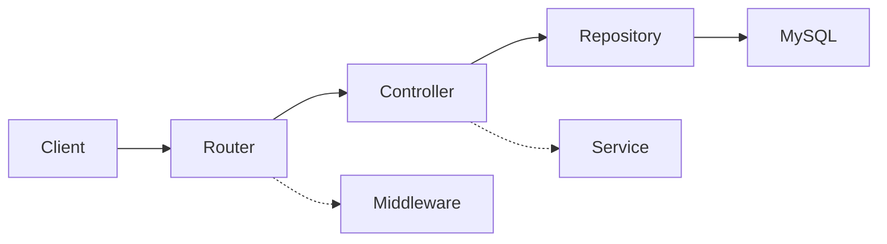

# 14 — Documentation

Documentation that is not maintained is worse than none. So we keep very little, and we keep
it where it cannot drift.

---

## 1. What every repo must have

| Doc | Lives in | Owner | Updated when |
|---|---|---|---|
| `README.md` | repo root | whoever changes setup | setup, scripts, or architecture changes |
| `CLAUDE.md` | repo root | tech lead | conventions change |
| `project/overview.md` | repo | tech lead | scope, stack, or the module split changes |
| `project/modules/<part>.md` | repo | module owner | that part's rules, data, API, or UI changes |
| `project/operations.md` | repo | whoever owns deploys | infra or process changes |
| `docs/error-codes.md` | repo | generated | every registry change (CI-generated) |
| `docs/api.md` | repo | generated from route schemas | every endpoint change |
| `docs/schema.md` + ER diagram | repo | generated from migrations | every migration |
| `CHANGELOG.md` | repo | generated from commits | every release |

Anything else is probably better as a code comment, a test, or nothing.

---

## 2. README structure

Fixed sections, in this order:

```markdown
# <Project> — <one-line description>

## Stack
Bulleted, with versions.

## Prerequisites
Node version, Docker, any account/credential needed.

## Getting started
```bash
cp .env.example .env      # fill in values from 1Password: <vault item>
docker compose up -d      # database + local services
npm ci
npm run db:migrate && npm run db:seed
npm run dev
```
App runs at http://localhost:3000

## Scripts
Table of the standard scripts and what they do here.

## Architecture
One diagram + 5 sentences. Link to `guidelines/<layer>/02-high-level-design.md`.

## Project structure
The annotated folder tree (copied from the layer's folder-structure guideline).

## Testing
How to run each level, and where tests live.

## Environments & deployment
Which branch/tag deploys where, and how to roll back.

## Troubleshooting
The 5 problems every new joiner hits.
```

A new engineer must get to a running app **from the README alone**, in under 30 minutes,
without asking anyone. That is the acceptance test for the README.

---

## 3. Generated documentation

Prefer generation over prose — generated docs cannot drift.

- **Error codes** — a script walks the `ERRORS` registry and emits a Markdown table
  (code, constant, HTTP status, message, domain). CI fails if the committed file is stale.
- **API reference** — a script walks the routers' `SCHEMA` consts and emits endpoint docs
  (or produces an OpenAPI document via `zod-to-openapi`). Same staleness check.
- **DB schema** — generated ER diagram from the migration files.
- **Component catalogue** — Storybook *is* the frontend component documentation. Every
  exported component has a story with `tags: ['autodocs']` and a `docs.description.component`.
- **Changelog** — from Conventional Commits.

---

## 4. In-code documentation

Follow `03-naming-and-conventions.md` §8. In short:

- Comment **why**, never what.
- JSDoc only on exported utilities with non-obvious behaviour, and on every `ERRORS` group.
- No changelog comments, no author tags, no commented-out code, no ASCII section banners.
- A `TODO` must be `// TODO(#142): ...` or it gets deleted in review.

Good:

```ts
// MySQL FULLTEXT requires a minimum token length of 4 by default (ft_min_word_len),
// so short search terms fall back to LIKE. See project/modules/articles.md §8.
```

Bad:

```ts
// This function gets the article by id
```

---

## 5. Recording decisions

Log a decision in the owning module's doc (§8 of the module template) when it is **expensive
to reverse**: adding a dependency, changing a data store, changing the auth model, introducing
a new layer, breaking an API.

- Newest first, append-only. To change a decision, add a new entry that says
  `Supersedes: <date> — <title>` and leave the old one.
- Short: context, decision, because, costs, revisit-if.
- **Be honest about the costs.** An entry with no downsides isn't a real analysis.
- Don't log routine implementation choices. If it's easy to change, it doesn't need an entry.

Decisions that span every module (auth model, error-code ranges, timezone policy) go in
`project/overview.md` under "Global constraints" instead.

---

## 6. Diagrams

Mermaid, in Markdown, in the repo. Never a binary image of a diagram, never a link to a
Figma/Miro board as the only copy.



Types we actually use:

| Diagram | Where |
|---|---|
| System context / container | `project/overview.md` |
| Module dependency graph | `project/overview.md` |
| Sequence (cross-module flow) | `project/overview.md` |
| Sequence (within one module) | that module's doc |
| ER diagram | `docs/schema.md` (generated) |
| State machine (e.g. article status) | that module's doc, §3 |

---

## 7. Keeping docs honest

- Any PR that changes setup, scripts, env keys, endpoints, error codes, or the DB schema
  **must** update the corresponding doc in the same PR. This is a reviewer checklist item.
- CI fails if a generated doc is out of date.
- Quarterly: delete docs nobody has read or updated. Fewer, truer docs.
