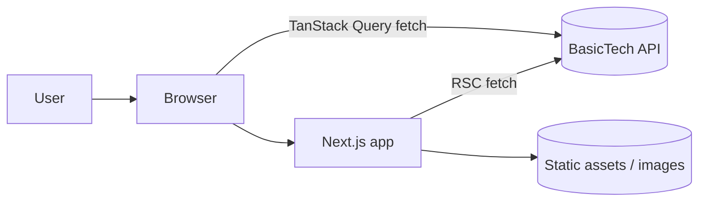
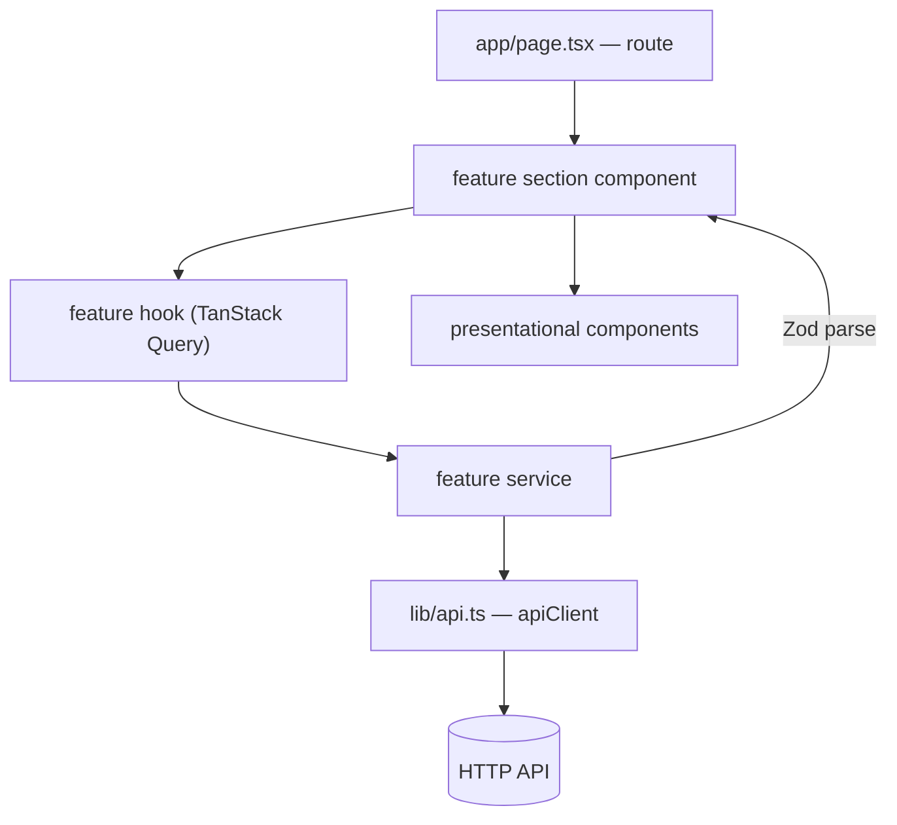

# Frontend — 02 High-Level Design

---

## 1. System context



The web app is a **rendering and interaction layer**. It owns no business truth. Every
authoritative decision — authorisation, validation, state transitions — happens on the API.
The client validates for UX; the server validates for correctness.

---

## 2. Layered data flow inside the app



| Layer | Owns | Must not |
|---|---|---|
| `app/*/page.tsx` | routing, metadata, composition | fetch, hold domain state, contain business rules |
| feature section component | orchestrating hooks + layout for one screen area | call `fetch` directly |
| feature hook | server-state lifecycle: keys, staleness, retries, invalidation | render JSX |
| feature service | one function per endpoint, URL construction, Zod parsing | know about React |
| `lib/api.ts` | transport: base URL, auth header, envelope, error mapping | know about any domain |
| presentational component | rendering props | fetch, know about TanStack Query |

**The rule that carries the most weight: a component never calls `fetch`.** Every network
access goes component → hook → service → `apiClient`.

---

## 3. Server vs Client Components

This is the highest-leverage architectural decision in a Next.js app.

### Default: Server Component

```
Server Component  ─ default. No 'use client'.
                  ─ can be async, fetch directly, read secrets, access the DB.
                  ─ ships ZERO JavaScript to the browser.

Client Component  ─ opt in with 'use client' at the top of the file.
                  ─ needed for: useState, useEffect, event handlers, browser APIs,
                    Context, TanStack Query hooks, animation libraries.
```

### Rules

| # | Rule |
|---|---|
| SC1 | `'use client'` is added at the **leaf** that needs interactivity, never at a page or layout, unless the whole screen is an app-shell (admin dashboards are a legitimate exception). |
| SC2 | Public, SEO-relevant, content-heavy pages (article detail, category feed, homepage) are **server-rendered**. Their data is fetched on the server. |
| SC3 | Authenticated dashboards may be client-rendered — they aren't indexed and are behind a login. |
| SC4 | A Server Component may render a Client Component. A Client Component may only receive Server Components as `children`/props, never import them. |
| SC5 | Props crossing the boundary must be serialisable — no functions, no class instances, no `Date` in some cases. Pass ISO strings. |

> **The reference `src/app/page.tsx` is `'use client'` and fetches the entire news homepage in
> the browser.** For a news site that is the wrong trade: no HTML for crawlers, a slow LCP,
> and five request waterfalls after hydration. Fetch on the server; hydrate only the
> interactive leaves.

### Recommended pattern: server-fetch + hydrate

```tsx
// app/(public)/page.tsx  — Server Component
export default async function HomePage() {
  const queryClient = new QueryClient();
  await Promise.all([
    queryClient.prefetchQuery({ queryKey: articleKeys.latest(), queryFn: () => fetchLatestArticles() }),
    queryClient.prefetchQuery({ queryKey: articleKeys.top(),    queryFn: () => fetchTopArticles() }),
  ]);

  return (
    <HydrationBoundary state={dehydrate(queryClient)}>
      <HomeSections />        {/* 'use client' — reads from the hydrated cache, no refetch */}
    </HydrationBoundary>
  );
}
```

Server-rendered HTML for crawlers and first paint, plus TanStack Query's caching and
refetching for interaction. One data-fetching mental model, both environments.

---

## 4. State taxonomy

Choose by **who owns the truth**.

| Kind | Owner | Tool |
|---|---|---|
| Server state | the API | **TanStack Query** — the only tool |
| URL state | the URL | `useSearchParams` / route params. Filters, tabs, page cursor, search term. |
| Form state | the form | React Hook Form (+ Zod resolver) |
| Local UI state | one component | `useState` / `useReducer` |
| Shared UI state | a subtree | Context, split by concern (auth, theme) |
| Derived state | nothing | compute during render or `useMemo` — **never `useState` + `useEffect`** |

**Global client state stores (Redux/Zustand) are not part of the standard stack.** Almost
everything people reach for Redux for is server state (belongs in TanStack Query) or URL state
(belongs in the URL). Introducing one needs a logged decision.

> The reference ships both Redux Toolkit and TanStack Query. Pick one owner per kind of state.

**Filters and pagination belong in the URL**, not `useState`: shareable, back-button-correct,
server-renderable, and survives refresh.

---

## 5. Rendering strategy per route type

| Route | Strategy | Why |
|---|---|---|
| Homepage, feeds | Server Component + `revalidate` (ISR) | SEO + fast LCP + cheap |
| Article detail | Server Component, `generateStaticParams` for hot IDs, ISR | SEO critical |
| Category / tag / region | Server Component + ISR | SEO |
| Search results | Server Component reading `searchParams` | shareable URLs |
| Admin / author dashboard | Client Component + TanStack Query | not indexed, highly interactive |
| Login | Client Component | form-driven |

Declare the strategy per route in the module's doc (§6).

---

## 6. Error and loading architecture

```
app/
  loading.tsx      ← route-level Suspense fallback (skeleton, not a spinner)
  error.tsx        ← route-level error boundary ('use client', has reset())
  not-found.tsx    ← 404
```

Plus, inside components, the three-state contract:

```tsx
if (isLoading) return <ArticleListSkeleton />;
if (error)     return <ErrorState error={error} onRetry={refetch} />;
if (data.length === 0) return <EmptyState />;
return <ArticleList articles={data} />;
```

Four states, always: **loading, error, empty, success**. A component that renders only the
success state is incomplete.

Mutation failures surface as a `sonner` toast, mapped from `error.code` — never from the
message string.

---

## 7. Design system layering

```
Tailwind v4 CSS variables (globals.css)   ← tokens: colour, radius, font
        ↓
components/ui/*  (shadcn + Radix)          ← primitives: Button, Dialog, Select
        ↓
components/molecules/*                     ← shared compositions
        ↓
features/*/components/*                    ← domain UI
        ↓
app/*/page.tsx                             ← screens
```

Each layer may only use the layer above it. A feature component never redefines a colour; it
uses a token. See [04-ui-and-design-system.md](04-ui-and-design-system.md).

---

## 8. Cross-cutting concerns

| Concern | Home |
|---|---|
| Auth session | `features/auth/hooks/use-auth.tsx` (Context) + httpOnly refresh cookie |
| Route protection | Next.js `middleware.ts` for redirects + server-side check in the layout |
| API transport | `lib/api.ts` |
| Query configuration | `lib/query-client.ts` |
| Theme | `next-themes` in `app/provider.tsx` |
| Toasts | `sonner`, mounted once in the root layout |
| Analytics | `@next/third-parties`, loaded in the root layout |
| Error reporting | Sentry, wired into `error.tsx` and the query client's `onError` |

---

## 9. Performance model

| Concern | Approach |
|---|---|
| First paint | Server Components + streaming with `<Suspense>` |
| Bundle size | `'use client'` at leaves only; `next/dynamic` for heavy widgets (markdown editor, charts) |
| Images | `next/image` with `remotePatterns`, explicit `sizes`, `priority` on the LCP image |
| Fonts | `next/font` with `display: swap`, self-hosted |
| Data | TanStack Query dedupes and caches; prefetch on the server |
| Waterfalls | `Promise.all` for independent fetches; never sequential awaits without a dependency |

Budgets are in [10-performance-and-seo.md](10-performance-and-seo.md).

---

## 10. Design checklist for a new screen or feature

- [ ] Which routes are added/changed, and is each server- or client-rendered?
- [ ] Which feature owns the new code? Is anything genuinely shared?
- [ ] Component tree sketch, marking the `'use client'` boundary.
- [ ] Query keys, stale times, and invalidation triggers.
- [ ] Which state is server / URL / form / local.
- [ ] Loading, error, and empty states for every async surface.
- [ ] SEO: metadata, structured data, canonical URL.
- [ ] New shared components to promote, and which stories they need.
