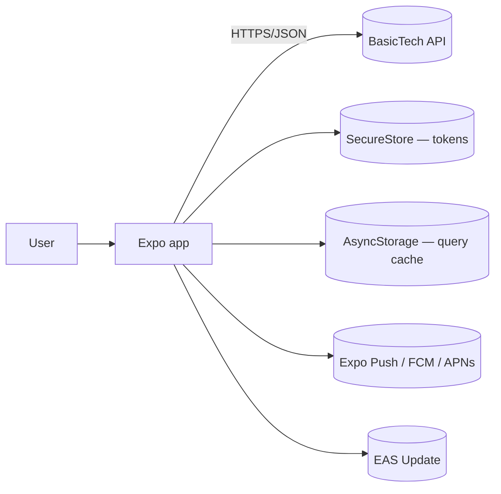
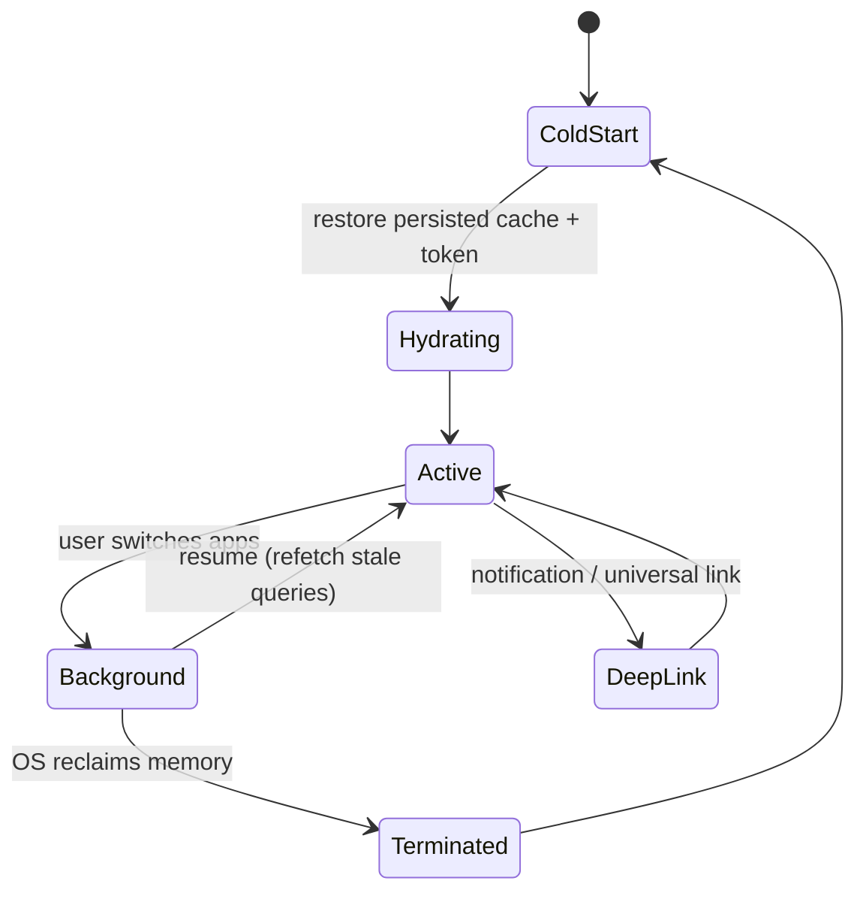

# Mobile — 02 High-Level Design

---

## 1. System context



The same rule as web: the app owns **no business truth**. Every authoritative decision is the
API's. The difference is that the mobile app must keep working — degraded but coherent — when
the API is unreachable.

---

## 2. Layered data flow

Identical to the web app:

```
route (app/*.tsx)
  → screen component (features/*/components/*-screen.tsx)
    → feature hook (TanStack Query)
      → feature service (Zod parse)
        → lib/api.ts (apiClient)
          → HTTP
```

A component never calls `fetch`. A hook never renders. A service never imports React.

---

## 3. What mobile adds

### 3.1 App lifecycle



Every screen must behave correctly for: cold start, resume after minutes, resume after days
(token expired), deep-link entry without the normal navigation stack, and low-memory
termination mid-flow.

```ts
// resume behaviour — refetch stale data when the app comes to the foreground
useEffect(() => {
  const subscription = AppState.addEventListener('change', (state) => {
    focusManager.setFocused(state === 'active');
  });
  return () => subscription.remove();
}, []);
```

### 3.2 Network reality

```ts
// online/offline drives TanStack Query directly
onlineManager.setEventListener((setOnline) =>
  NetInfo.addEventListener((state) => setOnline(!!state.isConnected)),
);
```

| Situation | Behaviour |
|---|---|
| Offline, data cached | render cached data + a persistent offline banner |
| Offline, no cache | offline empty state with a retry action |
| Offline, user mutates | queue the mutation, show "will sync", replay on reconnect |
| Reconnect | resume paused mutations, refetch stale queries |
| Slow network | skeletons; no request without a timeout |

Offline is a **product decision recorded in the module's doc**, not an afterthought. See
[06-data-offline-and-storage.md](06-data-offline-and-storage.md).

### 3.3 Storage tiers

| Tier | Use | Never |
|---|---|---|
| `expo-secure-store` (Keychain/Keystore) | access + refresh tokens, PII | large blobs |
| `AsyncStorage` | persisted query cache, non-sensitive preferences | tokens, secrets |
| In-memory | ephemeral UI state | anything that must survive a restart |
| File system (`expo-file-system`) | downloaded media | secrets |

**Tokens never go in `AsyncStorage`.** It is unencrypted plaintext readable on a rooted or
jailbroken device.

### 3.4 Permissions

Camera, photos, location, notifications. Rules:

- Request **in context**, immediately before the feature needs it — never all at launch.
- Show a pre-permission explainer before the OS prompt.
- Handle "denied" and "denied forever" with a deep link into system settings.
- Declare purpose strings in `app.config.ts` (iOS rejects builds without them).

---

## 4. Navigation architecture

```
app/_layout.tsx                 root: providers, splash, auth gate
├── (auth)/                     unauthenticated stack
│   └── login
└── (tabs)/                     authenticated tabs
    ├── index                   Home
    ├── explore
    └── profile
        └── articles/[id]       pushed onto the active tab's stack
```

Auth gating happens in the root layout by redirecting, not by conditionally mounting different
navigators — conditional navigators lose state and break deep links. See
[05-navigation.md](05-navigation.md).

---

## 5. State taxonomy

Identical to web, with two additions:

| Kind | Owner | Tool |
|---|---|---|
| Server state | the API | TanStack Query (+ persistence) |
| Navigation state | the router | Expo Router / URL params |
| Form state | the form | React Hook Form + Zod |
| Local UI | one component | `useState` |
| Shared UI | a subtree | Context |
| **Session** | SecureStore + Context | `use-auth` |
| **Device state** | the OS | `use-network-status`, `use-app-state`, permission hooks |

No global store. Same rule, same reasoning.

---

## 6. Error handling

Same `RequestError` model. Presentation differs:

| Error | Mobile presentation |
|---|---|
| Network unavailable | inline offline state + persistent banner, not a toast |
| 401 | silent refresh; on failure, clear session and route to `(auth)/login` |
| 403 | inline "you don't have access" |
| 404 | empty state with a back action |
| 5xx | retryable error state with a Retry button |
| Validation | inline on the field |
| Unexpected JS error | error boundary screen + Sentry report |

An `ErrorBoundary` wraps each stack. A crash on mobile means a force-close, which is far worse
than a broken page on the web — so boundaries are mandatory, not optional.

---

## 7. Push notifications

- Token registered after login, stored server-side against the user, cleared on logout.
- Every notification payload carries a `deepLink` path that the router can handle.
- Handle three states: app in foreground, background, and cold-started from the notification.
- Deep link targets must render correctly with **no navigation stack behind them** — always
  provide a sensible "back" destination.

---

## 8. Versioning and backward compatibility

You cannot force users to upgrade. Therefore:

- The API contract is **additive-only** for any endpoint a shipped app version calls.
- The app sends `X-App-Version`; the server can respond with a soft-update or force-update
  signal for versions below a floor.
- The app handles unknown enum values gracefully (Zod `.catch()` on enums where sensible)
  rather than crashing on a value added server-side after release.
- Breaking API changes require a version-gated endpoint and a documented sunset.

---

## 9. Update strategy

| Change | Mechanism | Latency |
|---|---|---|
| JS/asset only (most fixes) | **EAS Update** (OTA) | minutes |
| Native module added/changed, permissions, SDK upgrade | store build | days |

Every release is pinned to an update channel matching its build profile. Never OTA a JS bundle
that requires a native capability the installed binary lacks — it will crash on launch.

---

## 10. Design checklist for a new screen or feature

- [ ] Which routes/screens are added; where they sit in the navigator.
- [ ] Deep-link path, and what the screen does with no stack behind it.
- [ ] Offline behaviour: cached read? queued write? blocked?
- [ ] What is stored, and in which tier (Secure / Async / memory).
- [ ] Permissions required, and the in-context request point.
- [ ] Lifecycle: cold start, resume, background.
- [ ] iOS vs Android differences (safe area, back button, keyboard).
- [ ] Loading / error / empty / offline states for every async surface.
- [ ] Does this need a native module (store build) or is it OTA-able?
- [ ] Backward compatibility for older installed versions.
