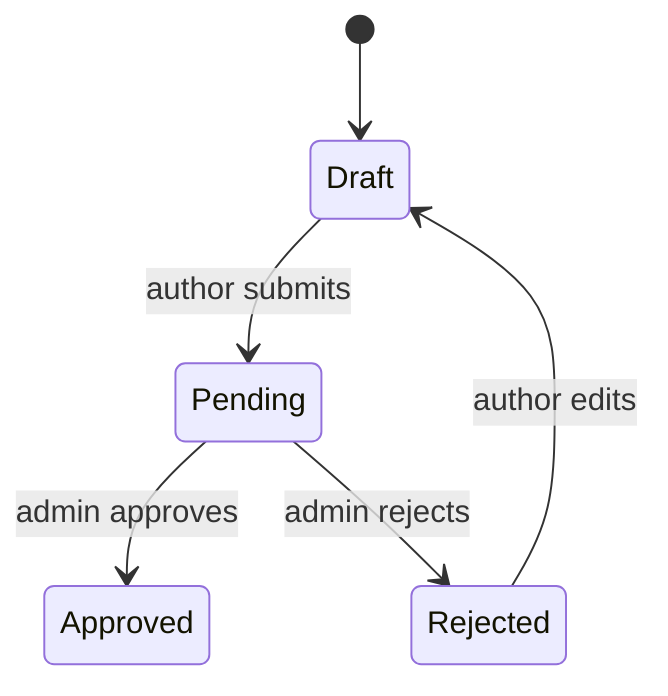

# Module: `<name>`

> Copy this file to `modules/<name>.md`. Keep the section order — every module doc looks the
> same so anyone can find anything. Delete sections that genuinely don't apply; don't reorder.

| | |
|---|---|
| **Owner** | `<person or pair>` |
| **Status** | planned \| in progress \| stable |
| **Backend** | `<src/controllers/x.controller.ts, src/repositories/x.repository.ts>` |
| **Web** | `<src/features/x/>` |
| **Mobile** | `<src/features/x/>` |

---

## 1. Purpose

<One paragraph. What this part is responsible for, in domain terms. If you can't say it
without listing files, the module isn't well defined.>

## 2. Boundaries

Being explicit here is what keeps modules independent.

**Owns**
- `<the article lifecycle and its status transitions>`
- `<the articles, article_tags, article_views tables>`

**Does not own**
- `<author identity — see modules/authors.md>`
- `<image storage — see modules/media.md>`

**Used by other modules via**
- `<ArticleRepository.findById — read-only, used by media for orphan cleanup>`

**Depends on**

| Module | For | How |
|---|---|---|
| `<authors>` | `<verifying the actor exists and is active>` | `<AuthorRepository.findById>` |

## 3. Domain

### Entities

| Entity | Key fields | Notes |
|---|---|---|
| `<Article>` | `<id, author_id, title, content, status, publish_date>` | |

### Enums

Each value exists identically in the TypeScript enum, the Zod schema, and the MySQL `ENUM`.
Changing one means changing all three plus a migration.

```ts
enum Status { Draft = 'draft', Pending = 'pending', Approved = 'approved', Rejected = 'rejected' }
```

### State machine



| From | To | Who | Guard |
|---|---|---|---|
| `draft` | `pending` | owner | `<required fields present>` |
| `pending` | `approved` | admin | — |
| `pending` | `rejected` | admin | `rejection_reason` required |

Any transition not listed returns `<X_STATUS_TRANSITION_NOT_ALLOWED>`.

### Rules

Numbered so they can be cited in code comments, tests, and review.

| # | Rule |
|---|---|
| `<ART>`-1 | `<An author may only edit their own content.>` |
| `<ART>`-2 | `<Approved content is editable only by an admin.>` |
| `<ART>`-3 | `<Public feeds show only approved content past its publish date.>` |

Each rule should have a test named after it.

### Permissions

| Action | Public | Owner | Other author | Admin |
|---|---|---|---|---|
| Read approved | ✅ | ✅ | ✅ | ✅ |
| Read draft | ❌ | ✅ | ❌ | ✅ |
| Update | ❌ | ✅ unless approved | ❌ | ✅ |
| Change status | ❌ | draft→pending only | ❌ | ✅ |

Role checks in middleware; ownership checks in the controller against the database.

## 4. Data

| Table | Purpose | Notes |
|---|---|---|
| `<articles>` | `<primary content>` | `<content is LONGTEXT — never in a list SELECT>` |
| `<article_tags>` | `<join>` | composite PK |

### Indexes and why

| Index | Serves |
|---|---|
| `<idx_status_id (status, id)>` | `<public feed: WHERE status = ? AND id < ? ORDER BY id DESC>` |

Composite indexes must cover the filter **and** the cursor order — see
`guidelines/backend/12-pagination.md` §6.

### Migrations

| # | File | What |
|---|---|---|
| `<003>` | `<003-create-articles.sql>` | initial |

## 5. API

| Method | Path | Auth | Cache | Paginated |
|---|---|---|---|---|
| GET | `<
/api/articles/approved/latest>` | none | `<5m>` | cursor |
| POST | `<
/api/articles>` | author | none | — |

Full contracts follow the block format in `guidelines/common/06-api-contract.md` §10. Keep them
here, next to the rules they enforce.

### `<GET /api/articles/approved/latest>`

| | |
|---|---|
| Auth | `<none>` |
| Ownership check | `<n/a>` |
| Cache | `<cacheMiddleware(CACHE_TTL.LATEST_FEED) — busted on publish>` |

**Query** — `<cursor: number (default MAX_SAFE_INTEGER), limit: number (1..100, default 10)>`
**Response 200** — `<paginatedEnvelope(ArticleSchema)>`

**Errors**

| Constant | Code | HTTP | When |
|---|---|---|---|
| `<INVALID_QUERY_PARAMETER>` | `<10003>` | 400 | `<cursor/limit invalid>` |
| `<ARTICLE_NOT_FOUND>` | `<50001>` | 404 | `<no matching row>` |

### Error code range

`<5xxxx>` — allocated to this module. Codes are immutable once shipped.

## 6. UI

| Surface | Route | Rendering | Notes |
|---|---|---|---|
| Web | `<
/articles/[id]>` | `<Server Component + ISR>` | `<SEO critical>` |
| Web | `<
/admin/articles>` | `<Client Component>` | `<not indexed>` |
| Mobile | `<app/articles/[id].tsx>` | — | `<deep link: basictech://articles/:id>` |

### Data hooks

| Hook | Query key | staleTime |
|---|---|---|
| `<useLatestArticles>` | `<articleKeys.latest()>` | `<STALE_TIME.FEED>` |

### Offline (mobile)

| Scenario | Behaviour |
|---|---|
| Read, cached | `<serve cache + offline banner>` |
| Write | `<blocked — publishing requires connectivity>` |

## 7. Failure modes

What breaks, what the user sees, and what we do about it.

| Failure | User sees | Handling |
|---|---|---|
| `<image upload fails>` | `<inline error on the form>` | `<article stays draft; retry>` |
| `<DB unreachable>` | `<generic error + requestId>` | `<500, logged, alert fires>` |

## 8. Decisions

Non-obvious choices for this module, newest first. Append-only — supersede rather than edit.

### `<YYYY-MM-DD>` — `<decision in one imperative line>`

**Context:** `<what forced a choice>`
**Decision:** `<what we do>`
**Because:** `<the reason that actually decided it>`
**Costs:** `<what this makes harder — if nothing, you haven't thought about it>`
**Revisit if:** `<the condition that changes the answer>`

## 9. Open questions

- [ ] `<question>` — *owner:* `<name>`
