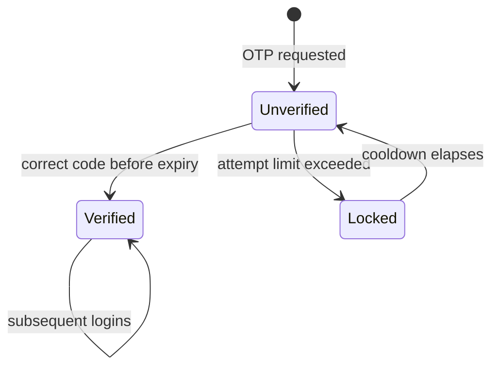

# Module: `accounts`

| | |
|---|---|
| **Owner** | `<TBD>` |
| **Status** | planned — deferred within v1, see §8 |
| **Backend** | `src/controllers/account.controller.ts`, `src/repositories/account.repository.ts`, `src/services/sms.service.ts` |
| **Web** | `src/features/account/` |
| **Mobile** | not in this repo |

---

## 1. Purpose

Owns identity: who someone is, and what role they hold. Citizens verify a mobile number by OTP
to unlock personal features; officers and operators hold staff roles issued out of band.

**Nothing in this module gates access to data.** The entire public portal — every dashboard,
map, alert and comparison — is readable with no account. Identity exists only to attach
preferences to a person and to protect the operator and governance surfaces.

## 2. Boundaries

**Owns**
- Accounts, roles, mobile-number verification, OTP issuance and expiry
- Sessions and tokens
- Saved districts (a citizen's own preference list)

**Does not own**
- Alert subscriptions — see `alerts.md`. This module answers "who is this"; `alerts` answers
  "what do they want to be told about".
- Any authorisation rule about domain data, because there are none.

**Used by other modules via**
- `authMiddleware` — populates `req.user`; used by operator and governance routes
- `AccountRepository.findById` — `alerts` resolves subscribers to a contact number

**Depends on**

Nothing internal. Externally, an SMS vendor.

## 3. Domain

### Entities

| Entity | Key fields | Notes |
|---|---|---|
| Account | `id, mobile, role, verified_at, created_at, last_login_at` | mobile is the only identifier; no email, no password for citizens |
| OtpChallenge | `id, mobile, code_hash, expires_at, attempts, consumed_at` | code is hashed, never stored plaintext |
| SavedDistrict | `account_id, area_id, created_at` | composite PK |

### Enums

```ts
enum Role { Citizen = 'citizen', Operator = 'operator', Officer = 'officer' }
```

### State machine



### Rules

| # | Rule |
|---|---|
| ACC-1 | No route serving public domain data requires authentication. Adding one is a blocking review comment. |
| ACC-2 | OTP codes are stored hashed and are single-use. A consumed challenge cannot be replayed. |
| ACC-3 | An OTP expires after `<TBD>` minutes. Expiry is enforced server-side against `expires_at`, never by a client timer. |
| ACC-4 | Maximum `<TBD>` verification attempts per challenge, then the challenge is locked and a new one must be requested. |
| ACC-5 | Resend is rate-limited per mobile number and per IP. OTP endpoints are the platform's only abusable write surface and its only per-message cost. |
| ACC-6 | `officer` and `operator` roles are never self-serve. They are granted out of band and never by an API. |
| ACC-7 | The mobile number is never displayed in full anywhere, including operator screens. |

### Permissions

| Action | Anonymous | Citizen | Officer | Operator |
|---|---|---|---|---|
| Read all public data | ✅ | ✅ | ✅ | ✅ |
| Save a district | ❌ | ✅ | ✅ | ✅ |
| Subscribe to alerts | ❌ | ✅ | ✅ | ✅ |
| Ingestion health, manual runs | ❌ | ❌ | ❌ | ✅ |
| Governance dashboard | ❌ | ❌ | ✅ | ❌ |

## 4. Data

| Table | Purpose | Notes |
|---|---|---|
| `accounts` | identity | `mobile` unique |
| `otp_challenges` | in-flight verifications | prune consumed and expired rows on a schedule |
| `saved_districts` | citizen preference | composite PK `(account_id, area_id)` |

### Indexes and why

| Index | Serves |
|---|---|
| `uq_account_mobile (mobile)` | login lookup |
| `idx_otp_mobile_expires (mobile, expires_at DESC)` | fetch the live challenge for a number; also the rate-limit count |

### Migrations

| # | File | What |
|---|---|---|
| `<TBD>` | `NNN-create-accounts.sql` | accounts, challenges, saved districts |

Numbered when the module is scheduled — it is not in the first build wave.

## 5. API

| Method | Path | Auth | Cache | Paginated |
|---|---|---|---|---|
| POST | `/api/auth/otp/request` | none | none | — |
| POST | `/api/auth/otp/verify` | none | none | — |
| POST | `/api/auth/refresh` | refresh token | none | — |
| POST | `/api/auth/logout` | citizen | none | — |
| GET | `/api/me` | citizen | none | — |
| PUT | `/api/me/districts` | citizen | none | — |

### `POST /api/auth/otp/request`

| | |
|---|---|
| Auth | none |
| Rate limit | per mobile **and** per IP — both, not either |

**Body** — `{ mobile: string }`, validated as an Indian mobile number.
**Response 200** — `{ expiresInSeconds }`. Never reveals whether the number already has an account.

**Errors**

| Constant | Code | HTTP | When |
|---|---|---|---|
| `INVALID_REQUEST_BODY` | `10002` | 400 | malformed number |
| `RATE_LIMITED` | `10011` | 429 | too many requests for this number or IP |
| `OTP_DELIVERY_FAILED` | `30004` | 502 | vendor rejected or unreachable |

### Error code range

`30xxx` — allocated to this module.

| Constant | Code | HTTP |
|---|---|---|
| `ACCOUNT_NOT_FOUND` | `30001` | 404 |
| `OTP_INVALID` | `30002` | 401 |
| `OTP_EXPIRED` | `30003` | 401 |
| `OTP_DELIVERY_FAILED` | `30004` | 502 |
| `OTP_ATTEMPT_LIMIT_REACHED` | `30005` | 429 |
| `MOBILE_NUMBER_INVALID` | `30006` | 400 |

`OTP_INVALID` and `ACCOUNT_NOT_FOUND` must never be distinguishable to an unauthenticated
caller — that difference enumerates registered numbers.

## 6. UI

| Surface | Route | Rendering | Notes |
|---|---|---|---|
| Web | `/[locale]/login` | Client Component | modal-first; never a full-page redirect from a dashboard |
| Web | `/[locale]/me` | Client Component | saved districts, subscriptions, sign out. Not indexed. |

Login is never a wall. It is offered at the moment a citizen tries to subscribe or save, and
declining leaves them exactly where they were.

### Data hooks

| Hook | Query key | staleTime |
|---|---|---|
| `useMe` | `accountKeys.me()` | 5m |
| `useRequestOtp` / `useVerifyOtp` | mutations | — |

## 7. Failure modes

| Failure | User sees | Handling |
|---|---|---|
| SMS vendor down | "Couldn't send the code — try again in a minute" | login unavailable; **the rest of the portal is unaffected** |
| DLT template mismatch | code never arrives, no error anywhere | operator-side: messages are dropped silently by the operator. Detect by delivery-report monitoring, not by user reports. |
| Token expired | silent refresh, then a prompt if that fails | never dumps a citizen out of the page they were reading |

## 8. Decisions

### `<TBD>` — Ship the public portal before OTP exists

**Context:** login unlocks only subscriptions and saved districts, while DLT registration takes
one to three weeks and requires the final SMS wording up front.
**Decision:** build and launch every public surface with no account concept. Add this module
when DLT approval lands.
**Because:** nothing a visitor came for depends on it, and blocking launch on telecom
bureaucracy for a preference list is the wrong trade.
**Costs:** alert *subscriptions* — arguably the most useful feature for a resident — ship late.
Push notification demand may force this earlier.
**Revisit if:** subscriptions become a launch requirement, in which case DLT registration moves
to week one.

### `<TBD>` — No email, no password, ever

**Decision:** mobile + OTP is the only citizen credential. Officer and operator accounts are
provisioned out of band.
**Because:** there is nothing to protect. The account holds a district list, not personal data,
so a password store would be pure liability.
**Costs:** account recovery is impossible if a number is lost — acceptable, since the account
holds nothing worth recovering.
**Revisit if:** accounts ever hold anything a person would miss.

## 9. Open questions

- [ ] OTP expiry, attempt limit, and resend cooldown — pick concrete numbers. Suggest 10 min,
      5 attempts, 60s cooldown. — *owner:* `<TBD>`
- [ ] SMS vendor: MSG91 is the usual choice for DLT handholding, but unconfirmed. — *owner:* `<TBD>`
- [ ] Exact DLT-registered template wording, in Hindi and English. Must be final before
      registration; changes require re-approval. — *owner:* `<TBD>`
- [ ] How are officer accounts provisioned, and who authorises? Blocks the governance
      dashboard, not v1. — *owner:* `<TBD>`
- [ ] Session lifetime and whether refresh tokens are used at all for a citizen account that
      guards nothing sensitive. — *owner:* `<TBD>`
