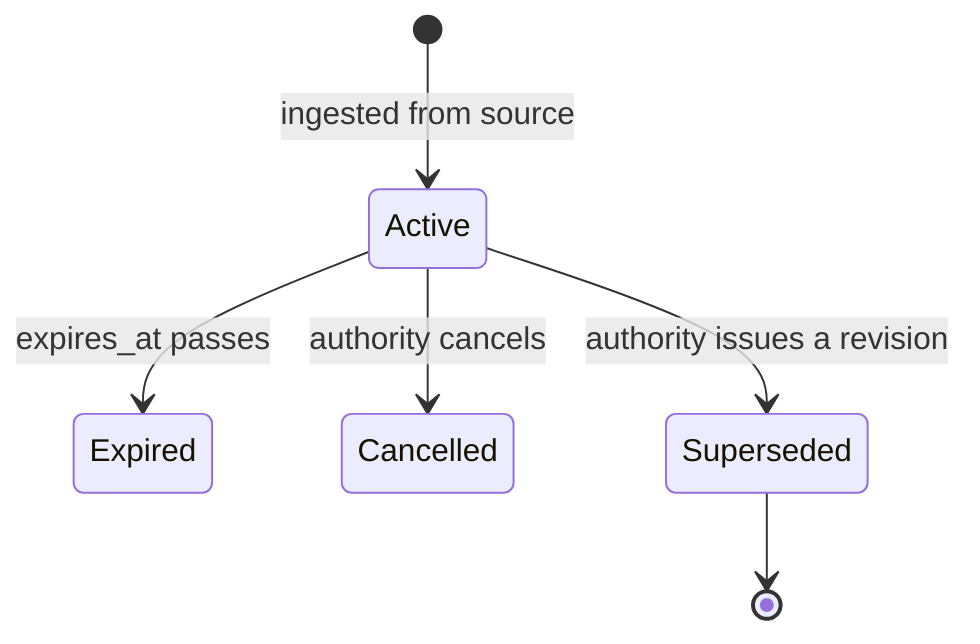

# Module: `alerts`

| | |
|---|---|
| **Owner** | `<TBD>` |
| **Status** | planned |
| **Backend** | `src/controllers/alert.controller.ts`, `src/repositories/alert.repository.ts`, `src/services/ingestion/cap.connector.ts` |
| **Web** | `src/features/alerts/` |
| **Mobile** | not in this repo |

---

## 1. Purpose

Owns time-bounded warnings issued by authorities: weather warnings, river and flood warnings,
road closure notices, and disaster incidents. An alert has a severity, an affected area, an
issuing authority and an expiry — that lifecycle is what separates this module from every other.

This is the module where correctness matters most. Everything else on the platform is
information; this is safety information, and a wrong or stale alert is worse than no alert.

## 2. Boundaries

**Owns**
- Alert records, their severity, their affected areas and their expiry
- Deduplication and supersession of alerts across repeated ingestion
- Subscriptions: which areas and severities a citizen wants to be told about, and delivery

**Does not own**
- The *measurement* that triggered a warning — see `hydromet.md`. A river level is an
  observation; "Ganga above danger mark at Haridwar" is an alert.
- Road *status* — see `roads.md`. A closed road is a road fact; the notice about it is an alert.
  Both exist, they reference each other, and neither is derived from the other.
- Identity — see `accounts.md`

**Used by other modules via**
- `AlertRepository.activeCountByArea(areaIds)` — the state overview's live counter

**Depends on**

| Module | For | How |
|---|---|---|
| `geography` | mapping upstream place names to district ids | `AreaRepository.resolveToDistricts` |
| `datasets` | provenance and ingestion runs | connector interface |
| `accounts` | resolving subscribers | `AccountRepository.findById` |

## 3. Domain

### Entities

| Entity | Key fields | Notes |
|---|---|---|
| Alert | `id, source_id, source_alert_id, type, severity, headline, body, language, issued_at, effective_from, expires_at, status, authority` | `headline`/`body` are in the source's language, never translated |
| AlertArea | `alert_id, area_id` | one alert affects many areas |
| Subscription | `account_id, area_id, min_severity, channels` | |

### Enums

```ts
enum AlertType { Weather = 'weather', River = 'river', Flood = 'flood', Road = 'road', Disaster = 'disaster' }
enum AlertSeverity { Minor = 'minor', Moderate = 'moderate', Severe = 'severe', Extreme = 'extreme' }
enum AlertStatus { Active = 'active', Expired = 'expired', Cancelled = 'cancelled', Superseded = 'superseded' }
```

Severity deliberately mirrors the CAP standard, because the IMD CAP feed is the first source and
re-mapping severities loses meaning.

### State machine



| From | To | Who | Guard |
|---|---|---|---|
| `active` | `expired` | system | `expires_at < now()` — computed, not a job |
| `active` | `cancelled` | ingestion | source marks it cancelled |
| `active` | `superseded` | ingestion | a newer alert with the same `source_alert_id` arrives |

No human transitions an alert. There is no editorial control over safety information.

### Rules

| # | Rule |
|---|---|
| ALR-1 | Alerts are upserted by `(source_id, source_alert_id)`, never appended. A revised warning replaces ours; it does not create a second contradictory one. |
| ALR-2 | Alert text is stored and shown in the source's language, marked with `language`, and is **never machine translated**. A mistranslated flood warning is a safety failure. |
| ALR-3 | Expiry is evaluated at read time against `expires_at`. An alert never depends on a cleanup job having run to stop showing. |
| ALR-4 | An alert with no resolvable area is stored with `status = active` and no `AlertArea` rows, and is surfaced to operators. It is never silently dropped. |
| ALR-5 | Alerts are never displayed without their issuing authority and issue time. |
| ALR-6 | The platform never issues an alert of its own, and never infers one from a measurement. It relays what authorities publish. |
| ALR-7 | Notification delivery is best-effort and must be described as such in the UI. The platform is not an emergency service. |

### Permissions

| Action | Anonymous | Citizen | Officer | Operator |
|---|---|---|---|---|
| Read alerts | ✅ | ✅ | ✅ | ✅ |
| Subscribe | ❌ | ✅ | ✅ | ✅ |
| Read unresolved-area queue | ❌ | ❌ | ✅ | ✅ |
| Create or edit an alert | ❌ | ❌ | ❌ | ❌ |

## 4. Data

| Table | Purpose | Notes |
|---|---|---|
| `alerts` | the alert record | `body` is `TEXT` — never in a list `SELECT` |
| `alert_areas` | affected areas | composite PK |
| `alert_subscriptions` | citizen subscriptions | composite PK `(account_id, area_id)` |

### Indexes and why

| Index | Serves |
|---|---|
| `uq_alert_source (source_id, source_alert_id)` | the upsert in ALR-1 |
| `idx_alert_active (status, expires_at, severity DESC)` | the state-wide active counter |
| `idx_alert_area_active (area_id, status, expires_at)` on `alert_areas` join | district dashboard: active alerts here |

### Migrations

| # | File | What |
|---|---|---|
| 007 | `007-create-alerts.sql` | alerts + areas |
| `<TBD>` | `NNN-create-alert-subscriptions.sql` | ships with `accounts` |

## 5. API

| Method | Path | Auth | Cache | Paginated |
|---|---|---|---|---|
| GET | `/api/alerts/active` | none | 60s | cursor |
| GET | `/api/alerts/:id` | none | 60s | — |
| GET | `/api/areas/:slug/alerts` | none | 60s | cursor |
| GET | `/api/alerts/summary` | none | 60s | — |
| PUT | `/api/me/subscriptions` | citizen | none | — |

Cache TTL is 60 seconds throughout — short enough to be current, long enough to survive a
front-page traffic spike during an incident, which is exactly when this module is under load.

### `GET /api/alerts/active`

**Query** — `type?`, `minSeverity?`, `areaSlug?`, `cursor?`, `limit?` (1..100, default 20)
**Response 200** — `paginatedEnvelope(AlertSummarySchema)` — headline, type, severity, areas,
authority, issue time. Body excluded; fetch the detail endpoint for it.

**Errors**

| Constant | Code | HTTP | When |
|---|---|---|---|
| `INVALID_QUERY_PARAMETER` | `10003` | 400 | bad cursor, limit, or enum value |
| `AREA_NOT_FOUND` | `40001` | 404 | unknown `areaSlug` |

### Error code range

`60xxx` — allocated to this module.

| Constant | Code | HTTP |
|---|---|---|
| `ALERT_NOT_FOUND` | `60001` | 404 |
| `ALERT_EXPIRED` | `60002` | 410 |
| `SUBSCRIPTION_LIMIT_REACHED` | `60003` | 409 |
| `ALERT_AREA_UNRESOLVED` | `60004` | 422 |
| `ALERT_SEVERITY_INVALID` | `60005` | 400 |

`ALERT_EXPIRED` is 410 rather than 404 deliberately: a shared link to a warning that has since
lapsed should say so, not claim the warning never existed.

## 6. UI

| Surface | Route | Rendering | Notes |
|---|---|---|---|
| Web | `/[locale]/alerts` | Client Component | live list, filterable, polls on the cache interval |
| Web | `/[locale]/alerts/[id]` | Server Component | shareable during an incident — SEO and OG tags matter |
| Web | `/[locale]/district/[slug]` | Server Component | the district's active alerts panel |
| Web | `/[locale]` | Server Component | the active-alert counter |

Severity is encoded in form as well as colour — a severity stripe and a text label, never colour
alone. Colour-blind users and greyscale printouts must read the same urgency.

### Data hooks

| Hook | Query key | staleTime |
|---|---|---|
| `useActiveAlerts(filters)` | `alertKeys.active(filters)` | 60s |
| `useAreaAlerts(slug)` | `alertKeys.byArea(slug)` | 60s |

## 7. Failure modes

| Failure | User sees | Handling |
|---|---|---|
| CAP feed unreachable | existing alerts continue until their own expiry, with a staleness note on the alerts page | never invent expiry; never blank the list |
| Alert names a place we cannot resolve | nothing at district level; the alert appears in the state-wide list | queued for operators (ALR-4) |
| Feed floods during a major event | list paginates; counters stay accurate | 60s cache absorbs the read spike |
| Notification delivery fails | nothing | logged; best-effort by design (ALR-7) |
| Two sources report the same incident | two alerts, both with their authority shown | correct — we do not merge across authorities |

## 8. Decisions

### `<TBD>` — Model on CAP, and adopt CAP severities unchanged

**Context:** the first available source is the IMD CAP feed, reachable with no key or approval.
USDMA may also publish CAP.
**Decision:** the alert entity mirrors CAP fields, and severity uses CAP's own scale.
**Because:** CAP is the international standard for this exact problem. Re-mapping severity into
a bespoke scale loses meaning at the point where meaning matters most, and every future
authority feed is more likely to be CAP than not.
**Costs:** a non-CAP source will need mapping *into* CAP rather than the reverse.
**Revisit if:** a major source publishes something structurally incompatible.

### `<TBD>` — Never translate alert text

**Decision:** store `language`, display as published. Where a source publishes both Hindi and
English, ingest both as separate rows linked by `source_alert_id`.
**Because:** the platform is bilingual, but machine-translating a safety warning creates
liability and can cause harm. A warning in the wrong language is recoverable; a wrong warning
is not.
**Costs:** a Hindi-locale user may see an English alert body. UI labels around it stay Hindi.
**Revisit if:** an authority provides an official translated feed.

## 9. Open questions

- [ ] Does USDMA publish CAP, or any machine-readable feed at all? Determines whether disaster
      alerts are a connector or a manual process. — *owner:* `<TBD>`
- [ ] Is there a Hindi CAP feed from IMD alongside `in-imd-en`? — *owner:* `<TBD>`
- [ ] How reliably do CAP `area` descriptions map to Uttarakhand districts? Needs a spike
      against real feed data — the resolution rate decides whether district-level alerting is
      viable at all. — *owner:* `<TBD>`
- [ ] Subscription limit per account, and delivery channel before mobile push exists. SMS costs
      money per message and this is a free public service. — *owner:* `<TBD>`
- [ ] Legal review of the disclaimer. The platform relays government alerts and is not an
      emergency service; that must be unambiguous on the page. — *owner:* `<TBD>`
