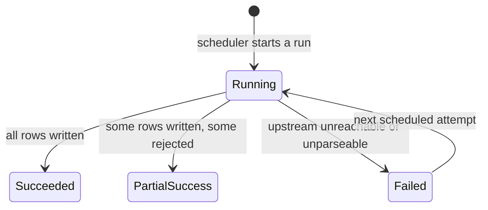

# Module: `datasets`

| | |
|---|---|
| **Owner** | `<TBD>` |
| **Status** | in progress — backend implemented, connectors stubbed, web not started |
| **Backend** | `backend/src/{models,repositories,controllers,routes}/source*.ts`, `backend/src/services/ingestion/`, `backend/src/utils/freshness.ts` |
| **Web** | `src/features/provenance/`, `src/features/ops/` |
| **Mobile** | not in this repo |

---

## 1. Purpose

Owns where data comes from and whether it can be trusted right now. It holds the registry of
every source, runs and records ingestion, and computes freshness. It is the module that lets a
population figure on a district page display "Census of India, 2011 — fetched 3 days ago" and
link back to the original.

It stores no domain values itself. Domain modules own their tables; this module owns the
`source_id` those tables point at and the machinery that filled them.

## 2. Boundaries

**Owns**
- The source registry: department, URL, attribution string, licence, expected cadence, access method
- Ingestion runs: what ran, when, what it fetched, what failed
- Freshness computation and the staleness contract
- The connector interface every domain module's fetcher implements

**Does not own**
- Any domain value. `datasets` never writes to `indicators`, `alerts`, or any other module's
  tables — a connector belonging to those modules does, and reports back here.
- Retry policy specific to one upstream's quirks — that belongs to the connector.

**Used by other modules via**
- `SourceRepository.findByIds` — hydrate provenance for a page of values
- `IngestionRunner.record(runId, outcome)` — a connector reports its own outcome
- `freshness(source, vintage, fetchedAt)` — pure function, the single definition of stale

**Depends on**

Nothing.

## 3. Domain

### Entities

| Entity | Key fields | Notes |
|---|---|---|
| Source | `id, key, department_en, department_hi, url, attribution, licence, access_method, cadence, may_redistribute` | `may_redistribute` is a legal fact per source, defaulting to `false` |
| IngestionRun | `id, source_id, started_at, finished_at, status, rows_written, error_code, notes` | append-only audit trail |

### Enums

```ts
enum AccessMethod { Api = 'api', Feed = 'feed', Bulk = 'bulk', Manual = 'manual' }
enum Cadence { Realtime = 'realtime', Hourly = 'hourly', Daily = 'daily', Monthly = 'monthly', Annual = 'annual', Static = 'static' }
enum RunStatus { Running = 'running', Succeeded = 'succeeded', Failed = 'failed', PartialSuccess = 'partial_success' }
enum Freshness { Fresh = 'fresh', Stale = 'stale', Expired = 'expired', Unknown = 'unknown' }
enum MetadataStatus { Provisional = 'provisional', Verified = 'verified' }
```

`AccessMethod.Manual` is deliberate: THDC and UJVNL publish PDFs, and a human entering a weekly
reservoir figure is a legitimate ingestion method that must carry the same provenance as an API.

`Freshness.Unknown` covers "no successful run yet", which is not the same as "old" — we have
never had the data at all. Every source is currently in this state.

`MetadataStatus` records whether a source's licence and redistribution terms have been confirmed
with the publishing body. Everything seeded before that conversation is `provisional`.

### State machine



A `Failed` run **never deletes or invalidates existing data.** Last-good values remain served,
with freshness degraded.

### Rules

| # | Rule |
|---|---|
| DS-1 | Every domain value stores `source_id`, `vintage` and `fetched_at`, all `NOT NULL`. A value that cannot name its source is not stored. |
| DS-2 | `vintage` is the date the data *describes*; `fetched_at` is when we retrieved it. A 2011 census figure fetched today has vintage 2011. Conflating these is the module's core failure. |
| DS-3 | Freshness is computed from cadence, never stored. Storing it guarantees it goes wrong. |
| DS-4 | A failed run never removes data. Degrade to stale; never blank. |
| DS-5 | Ingestion is idempotent. Re-running a source for the same vintage updates rows in place and must not duplicate them. |
| DS-6 | Nothing is displayed publicly from a source with `may_redistribute = false`. Access is not redistribution. |
| DS-7 | Every source has exactly one owning module. Two modules never ingest from the same source key. |
| DS-8 | A connector with no credentials or unverified access records a **skipped** run, not a failed one. Burying "not built yet" inside the failure count destroys the signal the failure count exists to carry. |
| DS-9 | A run left `running` past the timeout is expired, not treated as a lock. A crashed process must not hold a source hostage forever. |

### Permissions

| Action | Visitor | Officer | Operator |
|---|---|---|---|
| Read source attribution | ✅ | ✅ | ✅ |
| Read run history / ingestion health | ❌ | ✅ | ✅ |
| Trigger a run manually | ❌ | ❌ | ✅ |
| Register / edit a source | ❌ | ❌ | ✅ |

## 4. Data

| Table | Purpose | Notes |
|---|---|---|
| `sources` | the registry | ~25 rows; cached in process |
| `ingestion_runs` | audit trail | grows forever — partition or prune after `<TBD>` retention |

Both ship in migration `004`; the three self-serve sources are seeded by `005`, as a migration
rather than a dev seed because domain rows will hold foreign keys to their ids.

### Indexes and why

| Index | Serves |
|---|---|
| `uq_source_key (key)` | connectors resolve their own source by key at startup |
| `idx_run_source_started (source_id, started_at DESC)` | "last successful run for this source" — the freshness query, on every page |

### Migrations

| # | File | What |
|---|---|---|
| 004 | `004-create-sources.sql` | registry + runs |
| 005 | `005-seed-sources.sql` | the three sources needing no government approval |

## 5. API

| Method | Path | Auth | Cache | Paginated | Status |
|---|---|---|---|---|---|
| GET | `/api/sources` | none | 1h | no | shipped |
| GET | `/api/sources/:key` | none | 1h | no | shipped |
| GET | `/api/ops/ingestion/runs` | operator | none | cursor | deferred — see §8 |
| POST | `/api/ops/ingestion/:key/run` | operator | none | — | deferred — see §8 |

### `GET /api/sources`

Public, because the transparency promise requires that the source list itself be inspectable.
Returns department, URL, attribution, cadence and last-successful-run time. Never returns API
keys, credentials, or endpoint paths.

**Errors**

| Constant | Code | HTTP | When |
|---|---|---|---|
| `SOURCE_NOT_FOUND` | `90001` | 404 | unknown key |

### Error code range

`90xxx` — allocated to this module, covering upstream and ingestion failures.

| Constant | Code | HTTP |
|---|---|---|
| `SOURCE_NOT_FOUND` | `90001` | 404 |
| `UPSTREAM_UNAVAILABLE` | `90002` | 502 |
| `UPSTREAM_RESPONSE_INVALID` | `90003` | 502 |
| `UPSTREAM_RATE_LIMITED` | `90004` | 429 |
| `INGESTION_RUN_IN_PROGRESS` | `90005` | 409 |
| `SOURCE_NOT_REDISTRIBUTABLE` | `90006` | 403 |
| `CONNECTOR_NOT_AVAILABLE` | `90007` | 501 |

## 6. UI

| Surface | Route | Rendering | Notes |
|---|---|---|---|
| Web | `/[locale]/sources` | Server Component + ISR | the public transparency page |
| Web | — | — | `<SourceBadge>` renders inline beside every figure across the product |
| Web | `/[locale]/ops/ingestion` | Client Component | operator health board, not indexed |

`<SourceBadge>` is the module's most important artifact. It appears on every dashboard, so it
lives in `components/molecules/` and takes data via props — it never fetches.

### Data hooks

| Hook | Query key | staleTime |
|---|---|---|
| `useSources` | `sourceKeys.all()` | 1h |
| `useIngestionRuns` | `sourceKeys.runs(filters)` | 30s |

## 7. Failure modes

| Failure | User sees | Handling |
|---|---|---|
| Upstream unreachable | last-good values with a "stale" badge and the last-updated time | run marked `failed`, logged, alert to operators after N consecutive failures |
| Upstream schema changed | the same stale display | run marked `failed` with `UPSTREAM_RESPONSE_INVALID`; Zod parse failure is the detector |
| A run hangs | subsequent scheduled run refuses to start | `INGESTION_RUN_IN_PROGRESS` plus a run timeout that marks it failed |
| Source becomes non-redistributable | figures from it disappear from public pages | `may_redistribute` flips to false; queries exclude it. Must be a single switch, not a code change. |

## 8. Decisions

### 2026-09-03 — Defer the operator HTTP endpoints; drive ingestion from a CLI

**Context:** `/api/ops/ingestion/*` requires an authenticated operator, and `accounts` is not
built. The alternatives were an interim shared-secret header or no operator surface at all.
**Decision:** ingestion is driven by `npm run ingest`, which lists registry health and runs a
source. The HTTP endpoints ship with `accounts`.
**Because:** inventing an interim auth scheme for a privileged endpoint means writing security
code that is meant to be thrown away, which is exactly the code that survives. Shell access is
already a controlled privilege.
**Costs:** no operator health board in the browser yet, and no remote trigger.
**Revisit if:** `accounts` lands, or a scheduler outside the box needs to trigger a run.

### 2026-09-03 — An unavailable connector is skipped, not failed

**Context:** all three seeded connectors lack credentials or verification, so every scheduled
run would record a failure.
**Decision:** `isAvailable: false` produces a `skipped` report and opens no run row (DS-8).
**Because:** a failure count that is mostly "not built yet" is a failure count nobody reads,
and the first real outage would be invisible inside it.
**Costs:** a connector wrongly left unavailable is silently never run. The ingest CLI prints
every skip and its reason to make that visible.
**Revisit if:** skips need alerting of their own.

### `<TBD>` — Build the ingestion spine against three self-serve sources before any approval lands

**Context:** four of eight modules depend on departmental data requests with no SLA, while
data.gov.in, the IMD CAP feed and OSM are available immediately.
**Decision:** implement the connector interface, run recording, provenance and freshness against
those three — a keyed REST catalog, an XML feed, and a bulk geo extract.
**Because:** three different shapes prove the abstraction. Everything that arrives later is a
new connector against a working interface rather than new architecture under deadline pressure.
**Costs:** some interface churn when the first government API lands and does something none of
the three do.
**Revisit if:** IMD access arrives sooner than expected.

## 9. Open questions

- [ ] Retention for `ingestion_runs` — it grows unboundedly. — *owner:* `<TBD>`
- [ ] Where does the scheduler run? In-process (`node-cron`, simple, single-instance only) or an
      external job runner? Affects deployment topology. — *owner:* `<TBD>`
- [ ] **Per-source redistribution rights are unconfirmed for all three seeded sources.** All are
      `metadata_status = provisional`. IMD is `may_redistribute = false`, so alerts ingested from
      it could not be displayed — this is the blocking question for the `alerts` module, not just
      a paperwork item. — *owner:* `<TBD>`
- [ ] data.gov.in API key — free and instant, but not yet obtained. It is the single unlock for
      four modules. — *owner:* `<TBD>`
- [ ] Alerting channel and threshold for consecutive ingestion failures. — *owner:* `<TBD>`
