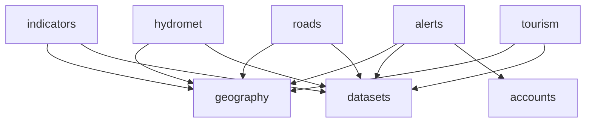
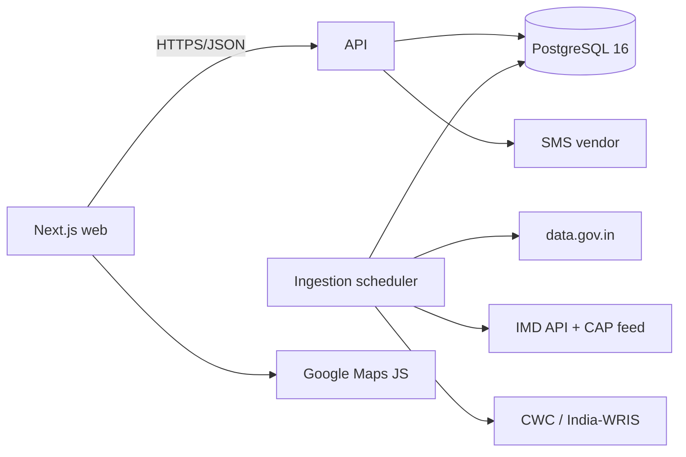
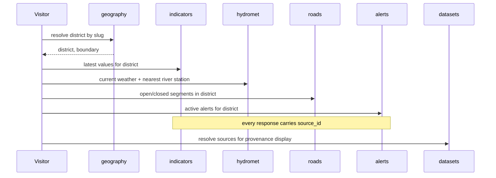
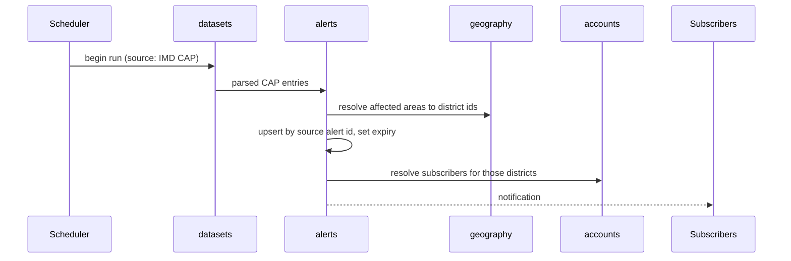

# Overview

> Level 1. The whole software on one page.

---

## What this is

**Pahad Pulse** is a public web portal that consolidates Uttarakhand government data — weather,
river levels, road closures, disaster alerts, tourism load, and district statistics — into one
place, with the source of every figure visible next to it. Anyone can open it without an
account. Its job is to answer "what is happening in this district right now, and where does
that number come from?" for residents, travellers, and journalists who would otherwise have to
check a dozen departmental portals.

The platform does not author data. It ingests, normalises, attributes, and displays data owned
by government departments. That constraint shapes every module: **provenance is a first-class
field, not a footnote.**

## Who uses it

| Role               | What they do                                                                                                       | Where       |
| ------------------ | ------------------------------------------------------------------------------------------------------------------ | ----------- |
| Visitor            | Browses everything — dashboards, maps, alerts, comparison. No account required.                                    | public web  |
| Registered citizen | A visitor who verified a mobile number to unlock alert subscriptions and saved districts. Sees no additional data. | public web  |
| Officer            | Authorised government user of the governance dashboard. Post-v1.                                                   | web, `/gov` |
| Operator           | BasicTech staff who register data sources and monitor ingestion health.                                            | web, `/ops` |

There is **no content-authoring role.** Nobody edits a population figure by hand; it arrives
from a source or it does not exist.

## Stack

| Layer   | Stack                                                                    | Location   |
| ------- | ------------------------------------------------------------------------ | ---------- |
| API     | Express 5 · TypeScript ESM · PostgreSQL 16 · neverthrow · Zod                  | `backend/` |
| Web     | Next.js 15 App Router · React 19 · TanStack Query · Tailwind v4 · shadcn | `web/`     |
| Mobile  | **Not in this repo.** Deferred; no work started.                         | —          |
| Hosting | Planned: Render Singapore (private Postgres + API + cron), Vercel (web) | `render.yaml` |

Deviations from `guidelines/common/13-approved-libraries.md`, each needing a logged decision in
the module doc that introduces it:

| Library                               | For                                        | Module                                        |
| ------------------------------------- | ------------------------------------------ | --------------------------------------------- |
| `next-intl`                           | Hindi/English routing and message catalogs | cross-cutting — decision in `geography.md` §8 |
| a map renderer (MapLibre GL proposed) | the interactive district map               | `geography.md` §8                             |
| `fast-xml-parser`                     | CAP alert feed parsing                     | `alerts.md` §8                                |
| `morphicons`                          | accessible icon state transitions          | cross-cutting navigation                      |

### 2026-09-04 — Use Morphicons for meaningful icon state changes

**Decision:** Use Morphicons for occasional controls where one icon changes into another to
communicate state, beginning with the mobile navigation Menu → Close toggle. Static data and
navigation icons remain static. Every morph opts into the user's reduced-motion preference.

**Because:** The transition makes the menu state change easier to follow without adding motion to
frequently scanned dashboard data.

**Costs:** The React entry adds a small client-side bundle and requires the vanilla `lucide` data
package alongside `lucide-react`; their versions must remain aligned.

---

## Module map

| Module       | Owns                                                         | Doc                     |
| ------------ | ------------------------------------------------------------ | ----------------------- |
| `geography`  | districts, tehsils, villages, boundaries, map layer registry | `modules/geography.md`  |
| `datasets`   | source registry, ingestion runs, provenance, freshness       | `modules/datasets.md`   |
| `accounts`   | citizen OTP identity, officer/operator accounts, roles       | `modules/accounts.md`   |
| `indicators` | all statistical datasets, comparison, trends                 | `modules/indicators.md` |
| `alerts`     | weather/river/road/disaster alerts, subscriptions            | `modules/alerts.md`     |
| `hydromet`   | weather, rainfall, river levels, dams                        | `modules/hydromet.md`   |
| `roads`      | road network, closures, live traffic                         | `modules/roads.md`      |
| `tourism`    | tourist flow, Char Dham, carrying capacity                   | `modules/tourism.md`    |

### Dependencies between modules

No cycles. `geography` and `datasets` are the spine: every domain module joins its rows to a
`geography` area and stamps them with a `datasets` source. Neither depends on anything, so both
can be built first and in parallel.

`alerts` is the only domain module that depends on `accounts`, and only for subscriptions —
alert _content_ is fully public and readable with no account.

| Module       | Depends on                    | Depended on by     |
| ------------ | ----------------------------- | ------------------ |
| `geography`  | —                             | all domain modules |
| `datasets`   | —                             | all domain modules |
| `accounts`   | —                             | alerts             |
| `indicators` | geography, datasets           | —                  |
| `alerts`     | geography, datasets, accounts | —                  |
| `hydromet`   | geography, datasets           | —                  |
| `roads`      | geography, datasets           | —                  |
| `tourism`    | geography, datasets           | —                  |

### Deferred — documented, not built

| Part                                        | Why deferred                                                                                                                                            | Reserved range |
| ------------------------------------------- | ------------------------------------------------------------------------------------------------------------------------------------------------------- | -------------- |
| `migration` (Palayan tracker)               | out of v1 scope. Village-scope migration and ghost villages. The Palayan Ayog data request is filed in week 1 regardless — it is the slowest to obtain. | `55xxx`        |
| `governance` (officer dashboard + AI layer) | out of v1 scope. Lives in this repo as a `/gov` route group when built; `accounts` already carries the officer role so nothing blocks it.               | `95xxx`        |

Neither has a module doc yet. Write one from `_TEMPLATE.md` when work starts.

---

## System context

Note the shape: **Google Maps is reached by the browser, not by the API.** Its content cannot be
stored (see Global constraints), so it never enters our database.

| External system  | Used for                                 | Failure behaviour                                                                |
| ---------------- | ---------------------------------------- | -------------------------------------------------------------------------------- |
| data.gov.in      | census, health, education, NHAI catalogs | ingestion run fails, logged; last-good values stay served with a staleness badge |
| IMD API          | weather observations, forecasts          | falls back to OpenWeatherMap; the source shown to the user changes accordingly   |
| IMD CAP feed     | weather warnings                         | run fails, logged; existing alerts continue until their expiry                   |
| CWC / India-WRIS | river levels, flood forecast             | last-good values with staleness badge                                            |
| Google Maps JS   | live traffic layer                       | traffic layer absent; the road network and closures still render                 |
| SMS vendor       | OTP                                      | login unavailable; the entire public portal is unaffected                        |

Nothing on this list can take the public portal down. Every external dependency degrades to
"older data, clearly labelled."

---

## Cross-module flows

### A citizen opens a district dashboard

The last step is why `datasets` exists as a module rather than a column. One district page
displays figures from six or more sources, each needing a department name, a URL, a vintage,
and a freshness state.

### A weather warning becomes a district alert

Alerts are **upserted by the source's own identifier**, never appended. A government body
revising a warning must revise ours, not add a second contradictory one.

---

## Glossary

| Term        | Means here                                                                                                                                                                 |
| ----------- | -------------------------------------------------------------------------------------------------------------------------------------------------------------------------- |
| Area        | Any geographic unit in `geography`: state, district, tehsil, or village. All domain data attaches to an area id.                                                           |
| District    | One of Uttarakhand's 13 districts. The primary unit of the whole product.                                                                                                  |
| Source      | A registered origin of data — a department, an API, or a document — with a URL and an attribution string. Owned by `datasets`.                                             |
| Vintage     | The date the data _describes_, not the date we fetched it. A 2011 census figure fetched today has a 2011 vintage. Distinct from `fetched_at`.                              |
| Freshness   | How current a value is relative to its source's expected cadence: `fresh`, `stale`, or `expired`. Computed, never stored.                                                  |
| Indicator   | A named, comparable statistic (`literacy_rate`, `per_capita_income`) with a unit and a scope.                                                                              |
| Observation | A time-stamped measurement from a station — rainfall, river level, temperature. Distinct from an indicator: high-frequency, not comparable across districts by definition. |
| Alert       | A time-bounded warning from an authority, with a severity and an affected area. Expires.                                                                                   |
| Char Dham   | The four pilgrimage sites — Kedarnath, Badrinath, Gangotri, Yamunotri. Drives the tourism module's peak load.                                                              |
| Palayan     | Out-migration from hill villages. The deferred `migration` module.                                                                                                         |

---

## Global constraints

Things that shape decisions across every module.

- **Every stored domain value carries `source_id`, `vintage`, and `fetched_at`.** A value that
  cannot name its source is not displayed. This is the product's core promise, so it is a schema
  constraint (`NOT NULL`), not a convention.
- **Google Maps content must never be persisted.** Their terms permit only limited caching, so
  live traffic renders client-side via the Maps JavaScript API and is discarded. Stored road
  data comes from OSM, NHAI, and PWD only. See `roads.md` §8.
- **Bilingual, Hindi and English.** Curated reference text (area names, indicator labels)
  carries `*_en` and `*_hi` columns, both `NOT NULL`. Ingested text (alert bodies, closure
  reasons) is stored in its source language with a `language` column and is **never machine
  translated** — a mistranslated flood warning is a safety failure. Where a source publishes
  both languages, both are stored as separate rows.
- **Numerals stay Latin in both locales.** Devanagari digits are not used; they hurt scanning
  in tables and break `tabular-nums` alignment.
- **All timestamps are UTC**; the pool is set to timezone `Z`. Display is IST (`Asia/Kolkata`),
  converted at the edge only.
- **Degrade, never fail.** Any upstream outage results in older data with a visible staleness
  badge. No blank dashboards, no error pages for stale data.
- **Error codes:** `1xxxx` and `2xxxx` are fixed across BasicTech. Per-module ranges below.
  Codes are immutable once shipped.

| Range   | Module                                     |
| ------- | ------------------------------------------ |
| `30xxx` | accounts                                   |
| `40xxx` | geography                                  |
| `50xxx` | indicators                                 |
| `55xxx` | _reserved_ — migration                     |
| `60xxx` | alerts                                     |
| `70xxx` | hydromet                                   |
| `80xxx` | roads                                      |
| `85xxx` | tourism                                    |
| `90xxx` | datasets (upstream and ingestion failures) |
| `95xxx` | _reserved_ — governance                    |

## Links

|                             |                                                                      |
| --------------------------- | -------------------------------------------------------------------- |
| Production                  | `<TBD>`                                                              |
| Staging                     | `<TBD>`                                                              |
| API base                    | `<TBD>`                                                              |
| Design                      | `<TBD>`                                                              |
| Issue tracker               | `<TBD>`                                                              |
| Secrets                     | `<TBD>`                                                              |
| Data access sequencing plan | https://claude.ai/code/artifact/fb27cd2c-6652-4f9b-9759-be103015f3fd |

## Open questions

- [ ] Deploy Render services in Singapore, obtain their outbound IP ranges from Connect →
      Outbound, and confirm IMD accepts those ranges before filing the whitelisting request.
      Render's default egress uses shared regional ranges, not a dedicated static IP.
      See [Render outbound IP documentation](https://render.com/docs/outbound-ip-addresses).
      Postgres will run as a Render private service; backup storage and restore verification remain open. — _owner:_ `<TBD>`
- [ ] Default locale: `hi` or `en`? Recommend `hi` for a resident-facing state portal, with
      `/en` available. Affects the root redirect and SEO canonical URLs. — _owner:_ `<TBD>`
- [ ] Is there a state-government stakeholder who can shorten the departmental data requests?
      Four of the eight modules depend on letters with no SLA. — _owner:_ `<TBD>`
