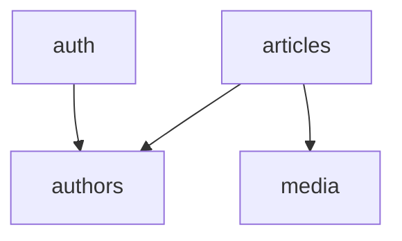
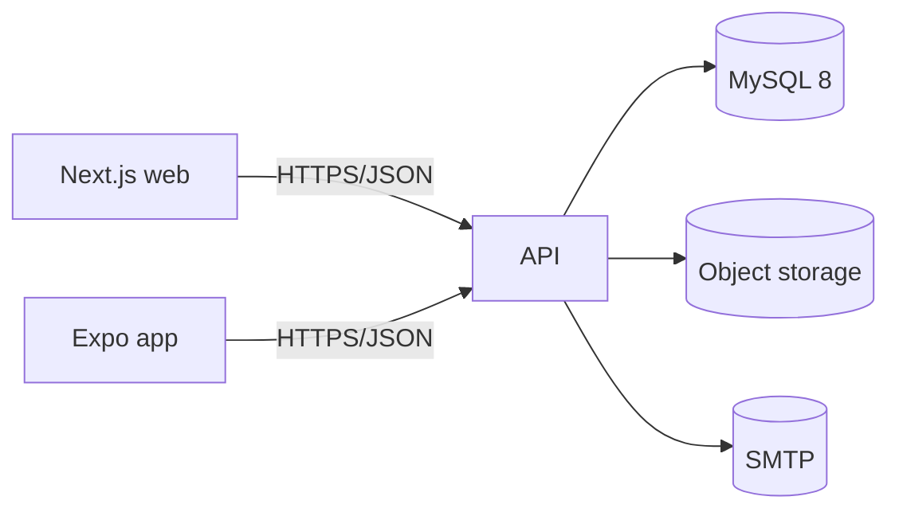
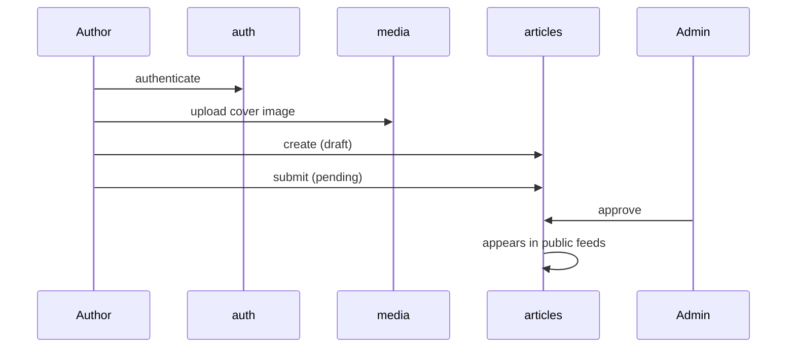

# Overview

> Level 1. The whole software on one page. Replace every `<placeholder>`.

---

## What this is

<One paragraph: what the product does and for whom. Written so someone who has never heard of
it understands the point in 30 seconds.>

## Who uses it

| Role | What they do | Where |
|---|---|---|
| `<Reader>` | `<browses and reads published content>` | public web, mobile |
| `<Author>` | `<writes and submits content for approval>` | web dashboard |
| `<Admin>` | `<approves, rejects, manages authors>` | web dashboard |

## Stack

| Layer | Stack | Location |
|---|---|---|
| API | Express 5 · TypeScript ESM · MySQL 8 · neverthrow · Zod | `<path>` |
| Web | Next.js 15 App Router · React 19 · TanStack Query · Tailwind v4 · shadcn | `<path>` |
| Mobile | Expo · React Native · Expo Router · NativeWind | `<path>` |
| Hosting | `<platform>` | |

Any deviation from `guidelines/common/13-approved-libraries.md` is noted in the module doc that
uses it.

---

## Module map

**The split of this software into independent parts.** One row here = one file in `modules/`.

| Module | Owns | Doc |
|---|---|---|
| `<auth>` | `<login, tokens, sessions, password reset>` | `modules/auth.md` |
| `<authors>` | `<author accounts and profiles>` | `modules/authors.md` |
| `<articles>` | `<article lifecycle, moderation, public feeds>` | `modules/articles.md` |
| `<media>` | `<image upload, storage, delivery>` | `modules/media.md` |

### Dependencies between modules

<One or two sentences on anything non-obvious in the graph — especially any cycle, which is a
smell worth explaining or removing.>

| Module | Depends on | Depended on by |
|---|---|---|
| `<auth>` | `<authors>` | `<all>` |
| `<articles>` | `<authors, media>` | — |

---

## System context

| External system | Used for | Failure behaviour |
|---|---|---|
| `<object storage>` | image hosting | `<upload fails → inline error, article stays draft>` |
| `<SMTP provider>` | OTP and notifications | `<logged and dropped / retried>` |

---

## Cross-module flows

Flows that cross module boundaries. Everything self-contained lives in its module doc.

### `<Author publishes an article>`

---

## Glossary

The words this codebase uses. Write this early — it prevents more confusion than anything else
in this folder.

| Term | Means here |
|---|---|
| `<Article>` | `<a piece of written content moving through draft → pending → approved>` |
| `<Region>` | `<the geographic tag on content; a closed enum>` |

## Global constraints

Things that shape decisions across every module.

- `<e.g. Shipped mobile versions can't be force-upgraded, so API changes are additive.>`
- `<e.g. All timestamps are UTC; the pool is set to timezone 'Z'.>`
- `<e.g. Error codes 1xxxx/2xxxx are fixed across BasicTech; 3xxxx+ are allocated per module.>`

## Links

| | |
|---|---|
| Production | `<url>` |
| Staging | `<url>` |
| API base | `<url>` |
| Design | `<figma url>` |
| Issue tracker | `<url>` |
| Secrets | `<password manager vault>` |
